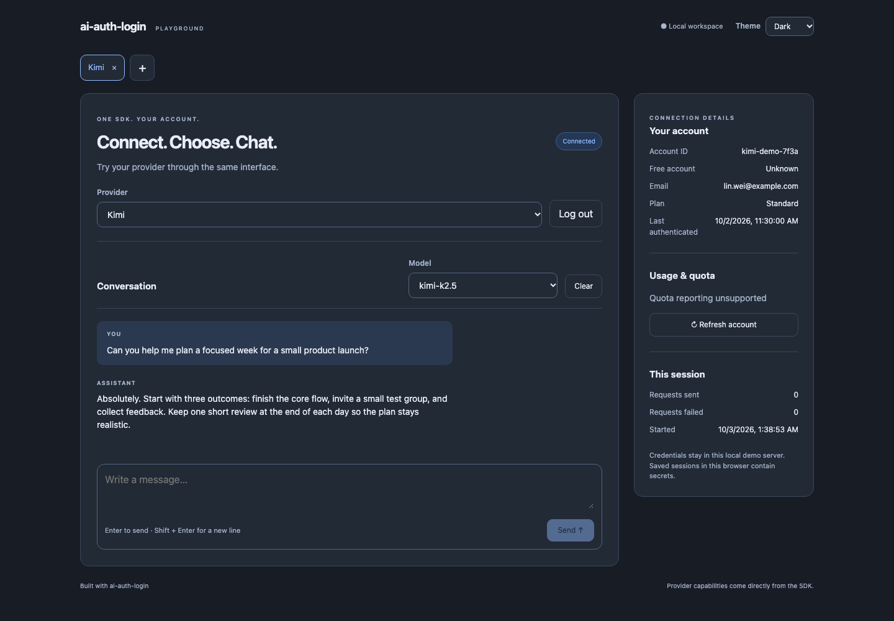

# ai-auth-login

Provider login and an OpenAI SDK client in one TypeScript package. Connect with browser login, an API key, a service account, or an AI Studio browser relay. The SDK sends requests in-process without a proxy server.

Requires Node.js 22 or newer. Provider support is listed in the [compatibility matrix](docs/compatibility.md).

## CLI demo

The bundled demo lets you connect providers, inspect account/quota details, and stream chat in independent tabs. After the package is published:

```sh
npx ai-auth-login
```



The screenshot uses fictional account and conversation data.

It opens `http://127.0.0.1:4317` in your browser. Use `--no-open` to open the URL yourself, or `--port 4320` to choose another port. Stop it with Ctrl+C. Browser local storage retains credentials and messages; use a trusted browser profile.

This checkout has not been published. To run the bundled demo locally:

```sh
npm ci
npm ci --prefix demo
npm run build:demo
node dist/cli.js
```

See the [demo guide](docs/demo.md) for development and local upstream checks.

## Authentication

After publication, install with `npm install ai-auth-login`. Restore saved state, check whether it is still valid, and log in if needed:

```ts
import { ProviderSession } from "ai-auth-login";

const session = new ProviderSession({ state: savedState });
session.onStateChange(saveState);

const auth = await session.checkAuth();
console.log(auth);

if (auth.ok && !auth.value.valid) {
  const started = await session.beginAuth("codex", { method: "callback" });

  if (started.ok && started.value.kind === "callback") {
    openBrowser(started.value.url);
    const completed = await started.value.complete(await askForCallbackURL());
    console.log(completed);
  }
}
```

`.ok` means the operation succeeded; `auth.value.valid` means the credentials are valid. `savedState` is opaque JSON containing secrets. Your application supplies `saveState`, `openBrowser`, and `askForCallbackURL`; save state securely and remove it when the listener receives `null`.

## SDK

Use the authenticated session to create an OpenAI SDK client:

```ts
const client = await session.createSDK();

if (client.ok) {
  const answer = await client.value.responses.create({
    model: "your-model",
    input: "Hello!",
  });

  console.log(answer.output_text);
}

await session.close();
```

The [login example](examples/basic.ts) shows browser/device login and state persistence; the [short SDK example](examples/sdk.ts) shows a request using saved state. The [SDK reference](docs/sdk.md) covers the full API and lifecycle. Expected package failures return `Result<T>`; OpenAI SDK requests throw the usual SDK errors.

[Contributing](CONTRIBUTING.md) covers code style and checks. [GitHub and release setup](docs/releasing.md) covers publishing and version tags.

Provider behavior and catalogs are ported from [CLIProxyAPI](https://github.com/router-for-me/CLIProxyAPI). MIT licensed; upstream attribution is preserved in [NOTICE](NOTICE).
